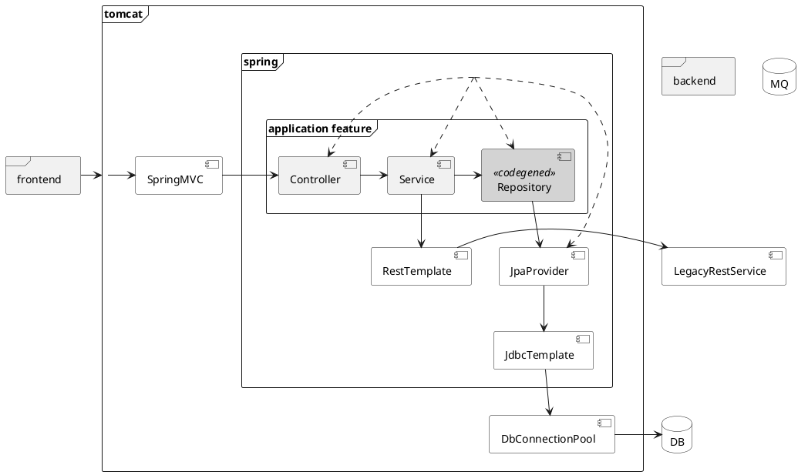

Автотестирование REST API на Spring MVC + Boot
==============================================
15 ак. ч., 5 дней.

Архитектура приложения
----------------------

puml

Тестирование Spring Core приложения
-----------------------------------
- [ ] Структура теста
- [ ] Именования
- [ ] Проверки
- [ ] Покрытие
- [ ] [Sprint Testing Framework](https://docs.spring.io/spring-framework/docs/current/reference/html/testing.html)

Тест-дублеры
------------
- [ ] Тест-дублеры: графы дублеров

Тестирование Spring Boot приложения
-----------------------------------
- [ ] Тестовые и production профили

Тестирование Spring Boot REST API
---------------------------------
- [ ] Структура автоматизированного теста на Spring MVC Test
- [ ] [Чем Spring Boot помогает в тестировании](https://docs.spring.io/spring-boot/docs/current/reference/htmlsingle/#boot-features-testing)

Особенности тестовой конфигурации
---------------------------------
- [ ] Родительские и дочерние контексты
- [ ] [Кеширование контекста](https://docs.spring.io/spring-framework/docs/current/spring-framework-reference/testing.html#testcontext-ctx-management-caching)

Тест-дублирование окружения приложения: внешние сервисы
-------------------------------------------------------
- [ ] Тест-дублеры внешних web- и REST-сервисов
- [ ] Контейнеризация окружения при тестировании приложения

Тест-дублирование окружения приложения: СУБД
--------------------------------------------
- [ ] Фейки СУБД
- [ ] [Утилиты работы с JDBC](https://docs.spring.io/spring-framework/docs/current/spring-framework-reference/testing.html#integration-testing-support-jdbc)
- [ ] [Управление транзакциями](https://docs.spring.io/spring-framework/docs/current/spring-framework-reference/testing.html#testcontext-tx-annotation-demo)
