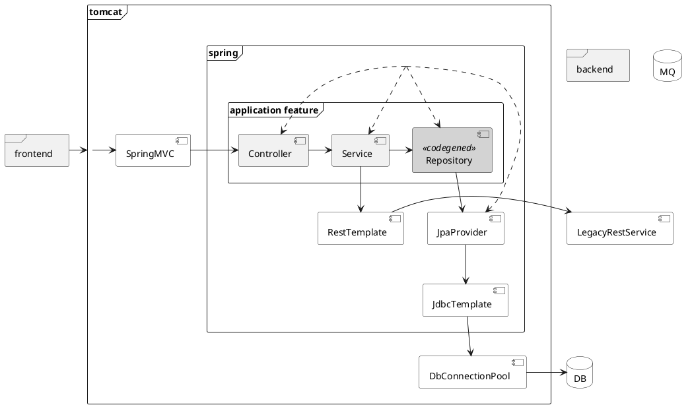

Автотестирование REST API на Spring MVC + Boot
==============================================
15 ак. ч., 5 дней.

Архитектура приложения
----------------------

puml

Тестирование Spring Core приложения
-----------------------------------
- [ ] Структура теста
- [ ] Именования
- [ ] Проверки
- [ ] Что покрываем?
- [ ] [Sprint Testing Framework](https://docs.spring.io/spring-framework/docs/current/reference/html/testing.html): тест как injection subject
- [ ] [Интеграция с JUnit5](https://docs.spring.io/spring-framework/docs/current/reference/html/testing.html#integration-testing-annotations-junit-jupiter)
- [ ] Тестовая конфигурация: [управление контекстом](https://docs.spring.io/spring-framework/docs/current/reference/html/testing.html#testcontext-ctx-management)
- [ ] Тестовая конфигурация: реализация компонентов
- [ ] Тестовая конфигурация: [свойства](https://docs.spring.io/spring-framework/docs/current/reference/html/testing.html#testcontext-ctx-management-property-sources)
- [ ] [Тест как injection subject](https://docs.spring.io/spring-framework/docs/current/reference/html/testing.html#testcontext-ctx-management)
- [ ] [Профили конфигурации](https://docs.spring.io/spring-framework/docs/current/reference/html/testing.html#integration-testing-annotations-spring)

Модульные тесты со Spring Core: Тест-дублеры
--------------------------------------------
- [ ] Понятие тест-дублера
- [ ] Виды тест-дублеров: dummy, stub, fake, mock, spy
- [ ] Графы дублеров
- [ ] Реализация на [Mockito](https://site.mockito.org)
- [ ] Интеграция со Spring Testing: [`@Mock`](https://www.baeldung.com/mockito-annotations)
- [ ] [Проблема тест-дублеров](https://www.baeldung.com/injecting-mocks-in-spring#2-the-tests): как сделать их частью spring context, но управлять из теста?
- [ ] [Проблема побочных эффектов и `@DirtiesContext`](https://docs.spring.io/spring-framework/docs/current/reference/html/testing.html#spring-testing-annotation-dirtiescontext)

Интеграционные тесты со Spring MVC: Тестирование REST API
---------------------------------------------------------
- [ ] Существующие тестовые библиотеки: [Spring Testing](https://docs.spring.io/spring-framework/docs/current/reference/html/testing.html#webtestclient-tests) и [MockMvc](https://docs.spring.io/spring-framework/docs/current/reference/html/testing.html#spring-mvc-test-framework)
- [MockMvc API](https://www.baeldung.com/integration-testing-in-spring) (Spring MVC Test)
- [WebTest Client API](https://docs.spring.io/spring-framework/docs/current/reference/html/testing.html#webtestclient)
- [ ] Что покрываем?
- [ ] [Установка фикстуры](https://docs.spring.io/spring-framework/docs/current/reference/html/testing.html#spring-mvc-test-server-setup-steps)
- [ ] [Реализация REST over HTTP вызова](https://docs.spring.io/spring-framework/docs/current/reference/html/testing.html#spring-mvc-test-server-performing-requests)
- [ ] [Реализация утверждений](https://docs.spring.io/spring-framework/docs/current/reference/html/testing.html#spring-mvc-test-server-defining-expectations)

Системные тесты со Spring MVC: Тестирование c БД
------------------------------------------------
- [ ] Фейки СУБД
- [ ] [Утилиты работы с JDBC](https://docs.spring.io/spring-framework/docs/current/spring-framework-reference/testing.html#integration-testing-support-jdbc)
- [ ] [Embedded databases support](https://docs.spring.io/spring-framework/docs/current/reference/html/data-access.html#jdbc-embedded-database-support)
- [ ] [Аннотации](https://docs.spring.io/spring-framework/docs/current/reference/html/testing.html#integration-testing-annotations-spring)
- [ ] [Инициализация БД и выполнение SQL из тестов](https://docs.spring.io/spring-framework/docs/current/reference/html/testing.html#testcontext-executing-sql)
- [ ] [Управление транзакциями](https://docs.spring.io/spring-framework/docs/current/reference/html/testing.html#testcontext-tx)

Тестирование Spring Boot приложений
-----------------------------------
- [ ] [Миграция приложения на Spring Boot](https://spring.io/guides/gs/spring-boot/) 
- [ ] [Чем Spring Boot помогает в тестировании](https://docs.spring.io/spring-boot/docs/current/reference/htmlsingle/#boot-features-testing)
- [ ] Специальный вид тестов [`@SpringBootTest`](https://www.baeldung.com/spring-boot-testing) и производные виды (slices)

Модульные тесты со Spring Boot: Тест-дублеры
--------------------------------------------
- [ ] Интеграция Mockito и Spring Boot: [`@MockBean`](https://www.logicbig.com/tutorials/spring-framework/spring-boot/testing-with-mocking-beans.html)

Интеграционные тесты со Spring Boot: Тестирование REST API
----------------------------------------------------------
- [ ] Специальный вид тестов [`@WebMvcTest`](https://spring.io/guides/gs/testing-web/)
- `webEnvironment` и `@LocalServerPort`

Системные тесты со Spring Boot: Тестирование c БД
-------------------------------------------------
- [ ] Провиженинг БД с [Liquibase](https://www.baeldung.com/liquibase-refactor-schema-of-java-app)
- [ ] Специальный вид тестов [`@DataJpaTest`](https://reflectoring.io/spring-boot-data-jpa-test/)

Тест-дублирование окружения приложения: внешние сервисы
-------------------------------------------------------
- [ ] Специальный вид тестов [`@RestClientTest`]((https://www.baeldung.com/restclienttest-in-spring-boot))
- Spring [MockRestServiceServer](https://docs.spring.io/spring-framework/docs/current/reference/html/testing.html#spring-mvc-test-client)
- [ ] Альтернативные тест-дублеры внешних web- и REST-сервисов
- [MockServer](https://www.mock-server.com)
- [Wiremock](http://wiremock.org)
- [ ] Контейнеризация окружения при тестировании приложения
- [TestContainers](https://www.testcontainers.org)

Особенности тестовой конфигурации
---------------------------------
- [ ] [Оптимизация интеграционных тестов](https://www.baeldung.com/spring-tests) 
- [ ] [Использование родительских и дочерних контекстов](https://docs.spring.io/spring-framework/docs/current/reference/html/testing.html#testcontext-ctx-management-ctx-hierarchies)
- [ ] [Кеширование контекста](https://docs.spring.io/spring-framework/docs/current/spring-framework-reference/testing.html#testcontext-ctx-management-caching)
- [ ] [Параллельное выполнение тестов](https://docs.spring.io/spring-framework/docs/current/reference/html/testing.html#testcontext-parallel-test-execution)